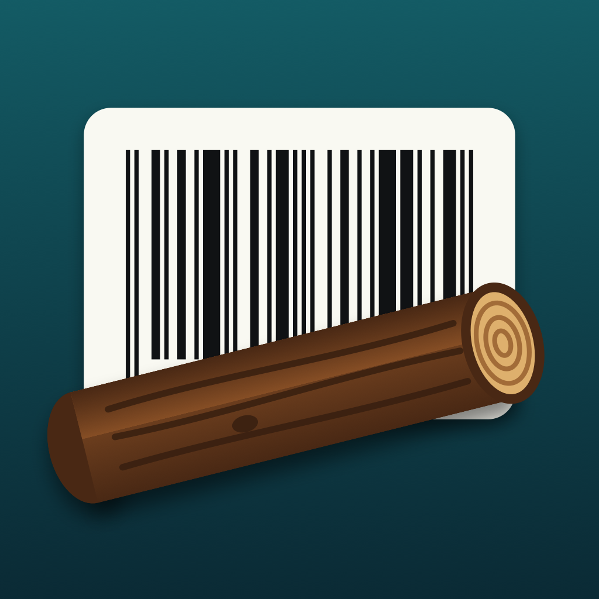

# UPC Logger



An iPhone app, written in Common Lisp, for counting things by their barcodes.

- **Scanning:** the top third of the screen is a live camera view that reads UPC-A, UPC-E and EAN-8/13 codes.
- **Repeat scans:** scanning the same code as the top row bumps its count rather than adding a row. A label held in front of the camera counts once, however long it is held.
- **Setting a count:** tap a row and type how many there are on the number pad. Scan one of a case of eight, tap it, type `8`, and the row reads `8 x 012345678905`. `0` removes the row, and so does swiping left.
- **Saving:** the log is written after every change to `Documents/scans.sexp`, a readable s-expression with universal-time timestamps.

## The chart

Below the camera is a histogram of items scanned, with time across the bottom. It shows the last day to begin with and follows new scans as they arrive.

- **Zoom:** pinch. The moment under your fingers stays put, and the bars re-bin themselves — half hours over a day, minutes over an hour.
- **Scroll:** drag left and right through time.
- **Un-zoom:** the **Reset** button, or a double tap on the chart. Either brings back the last day and starts following new scans again.

Touching the chart stops it following, so it will not jump while you are reading it.

The table underneath lists the scans inside the visible range, and the line above it counts them. Zoom into an hour and the table narrows to that hour.

## Exporting

**Share** opens the system share sheet straight away, carrying the scans in view in two formats at once:

- **CSV** — the default: code, count, scanned, last scanned, and the raw universal time, quoted per RFC 4180.
- **PDF** — a page with the same histogram the screen is showing, then the table, over as many pages as it takes.

They are two representations of one shared item, so there is no list of formats to get past first: the destination takes the one it can use. Numbers and Sheets ask for the CSV, Books and Print for the PDF, and AirDrop and Files take the first registered, which is the CSV.

Both cover exactly the visible range, from the same rows, so the two cannot disagree.

Apple's own **Options** panel — the one offering lossless or most-compatible for a photo — is not public API. `UIActivityItemsConfigurationReading` carries a title, a message body, link metadata and previews, and nothing that names a format. Registering several representations on one `NSItemProvider` is the mechanism underneath it that third-party code may use, so the choice is made by the receiving app rather than by a switch in the sheet.

## How it is built

- **Build:** [asdf-ios-app](https://github.com/lispnik/asdf-ios-app) compiles it with ECL into an ordinary signed `.app`; there is no Xcode project.
- **UIKit and AVFoundation:** the [objc](https://github.com/lispnik/objc) bridge reaches them from Lisp. The table's data source, the capture metadata delegate, the chart view and its gestures, and the PDF renderer's block are all Lisp.

| Path | What |
|---|---|
| `src/core/` | The model: code normalisation and check digits, the log, saving, the scan gate, the visible window (zoom, pan, bins, ticks) and CSV. Portable CL, no dependencies. |
| `src/ios/chart.lisp` | The histogram view, drawn into a rectangle — the same function fills the chart on screen and the one in the PDF. |
| `src/ios/scan-table.lisp` | A reusable table of scans: hand it a function returning rows, and optionally what a tap and a swipe should do. |
| `src/ios/share.lisp` | CSV and PDF, and the share sheet. |
| `tests/` | FiveAM tests for the core, run on the Mac. |
| `tools/icon.lisp` | Draws the icon with AppKit; `make icon` regenerates it. |

## Building

You need Xcode, [ocicl](https://github.com/ocicl/ocicl), and these checkouts side by side:

```sh
git clone https://github.com/lispnik/objc.git
git clone https://github.com/lispnik/asdf-ios-app.git
git clone https://github.com/lispnik/upc-logger.git
cd upc-logger && make deps
```

You also need an ECL toolchain for iOS:
- **Default:** run `(asdf-ios-app:bootstrap-ecl)` once.
- **Existing toolchain:** point `ECL_DIR` at a directory holding matched `ecl-native`, `ecl-iOS` and `ecl-iOS-sim` prefixes. The Makefile looks in `~/Projects/ecl` by default.

```sh
make test       # the FiveAM suite, on the host
make run-sim    # build, install and launch on the booted simulator
make demo-sim   # the same, with a few scripted scans
make device     # build, install and launch on a connected iPhone
```

A simulator has no camera, so there the preview area shows a **Simulate scan** button. `UPC_LOGGER_DEMO_PROMPT=1` and `UPC_LOGGER_DEMO_SHARE=1` add the count prompt and the export sheet to the scripted run.

`make device` needs a development identity and a provisioning profile, set in a `local.mk` that is not committed:

```make
IOS_SIGNING_IDENTITY = Apple Development: Your Name (XXXXXXXXXX)
IOS_PROVISIONING_PROFILE = /path/to/profile.mobileprovision
```

The phone must be unlocked, with Developer Mode on.

## License

MIT
